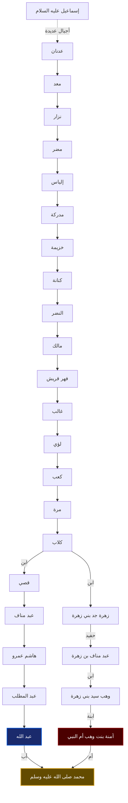
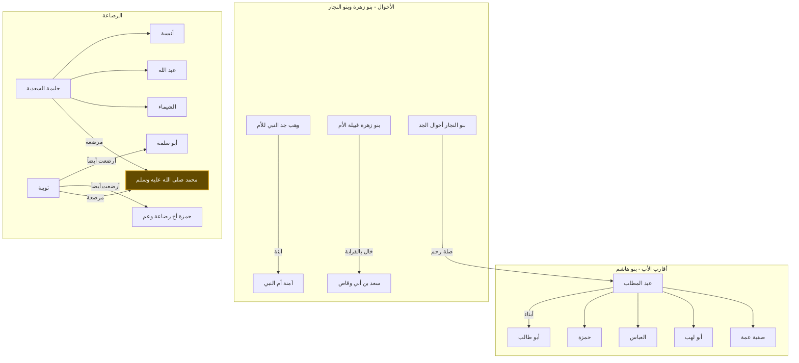

# نسب وعائلة النبي محمد ﷺ (متحقق وموثق)

هذا المستند يقدم عرضاً بيانياً وتفصيلياً لنسب النبي محمد ﷺ، زوجاته، أبنائه، وأقاربه، بناءً على أصح الروايات الواردة في "البداية والنهاية" لابن كثير، و"السيرة النبوية" لابن هشام، و"زاد المعاد" لابن القيم.

---

## 1. النسب الشريف (من إسماعيل عليه السلام إلى الوالدين)

يوضح هذا الرسم السلسلة الذهبية المجمع عليها من عدنان إلى النبي ﷺ.

---

## 2. بيت النبوة (الزوجات، الأبناء، والأحفاد)

يركز هذا الرسم على الزوجات اللاتي أنجبن، وبنات النبي ﷺ وعائلاتهن.

```mermaid
flowchart TD
    node_kh["خديجة بنت خويلد"]
    node_ma["مارية القبطية"]
    node_sw["سودة"]
    node_ai["عائشة"]
    node_hf["حفصة"]
    node_zky["زينب بنت خزيمة"]
    node_us["أم سلمة"]
    node_zj["زينب بنت جحش"]
    node_jw["جويرية"]
    node_uh["أم حبيبة"]
    node_sh["صفية بنت حيي"]
    node_my["ميمونة"]
    node_qas["القاسم"]
    node_abs["عبد الله الطاهر"]
    node_ibr["إبراهيم"]
    node_zd["زينب بنت محمد"]
    node_aa["أبو العاص بن الربيع"]
    node_um["أمامة بنت أبي العاص"]
    node_rq["رقية بنت محمد"]
    node_ut1["عثمان بن عفان - الزوج الأول"]
    node_abu["عبد الله بن عثمان"]
    node_ukm["أم كلثوم بنت محمد"]
    node_ut2["عثمان بن عفان - بعد رقية"]
    node_ft["فاطمة الزهراء"]
    node_al["علي بن أبي طالب"]
    node_hsn["الحسن"]
    node_hsn2["الحسين"]
    node_ukh2["أم كلثوم"]
    node_znh["زينب"]
    node_hh1["هند"]
    node_hl1["هالة"]
    node_hh2["هند بنت"]

    subgraph S1 [أمهات المؤمنين - من أنجبن]
        node_kh
        node_ma
    end

    subgraph S2 [أمهات المؤمنين]
        node_sw --- node_ai --- node_hf --- node_zky
        node_us --- node_zj --- node_jw --- node_uh
        node_sh --- node_my
    end

    subgraph S3 [أبناء النبي صلى الله عليه وسلم - الذكور]
        direction LR
        node_kh -->|ابن| node_qas
        node_kh -->|ابن| node_abs
        node_ma -->|ابن| node_ibr
    end

    subgraph S4 [بنات النبي صلى الله عليه وسلم وعائلاتهن]
        subgraph F1 [عائلة زينب]
            direction TB
            subgraph Z1 [الزوجين 1]
                direction LR
                node_zd --- node_aa
            end
            node_zd -->|ابنة| node_um
            node_kh -->|ابنة| node_zd
        end

        subgraph F2 [عائلة رقية]
            direction TB
            subgraph Z2 [الزوجين 2]
                direction LR
                node_rq --- node_ut1
            end
            node_rq -->|ابن| node_abu
            node_kh -->|ابنة| node_rq
        end

        subgraph F3 [عائلة أم كلثوم]
            direction TB
            subgraph Z3 [الزوجين 3]
                direction LR
                node_ukm --- node_ut2
            end
            node_kh -->|ابنة| node_ukm
        end

        subgraph F4 [عائلة فاطمة]
            direction TB
            subgraph Z4 [الزوجين 4]
                direction LR
                node_ft --- node_al
            end
            node_ft -->|ابن| node_hsn
            node_ft -->|ابن| node_hsn2
            node_ft -->|ابنة| node_ukh2
            node_ft -->|ابنة| node_znh
            node_kh -->|ابنة| node_ft
        end
    end

    subgraph S5 [أبناء خديجة من أزواج سابقين]
        direction LR
        node_kh -->|من أبي هالة| node_hh1
        node_kh -->|من أبي هالة| node_hl1
        node_kh -->|من عتيق| node_hh2
    end
```

---

## 3. الدائرة الممتدة (الأعمام، الأخوال، والرضاعة)

يوضح هذا الرسم الأقارب والصلات الواردة في السير الموثقة.

---

## 4. تدقيق المعلومات بناءً على المصادر الموثقة

- **النسب**: السلسلة من عدنان إلى النبي ﷺ صحيحة ومجمع عليها كما ذكرها ابن كثير في "البداية والنهاية".
- **إخوة النبي**: الثابت أنه لم يكن للنبي ﷺ إخوة من أبيه أو أمه، وكل إخوته هم من الرضاعة.
- **أخوال النبي**: آمنة بنت وهب كانت وحيدة أبويها، وما يشتهر من "أخوال النبي" هم أقاربها من بني زهرة (كسعد بن أبي وقاص) أو أخوال جده من بني النجار (لقول النبي: هؤلاء أخوالي).
- **أبناء السيدة خديجة**: ثبت في السيرة (ابن سعد وغيره) أن لها ولدين من "أبو هالة" (هند وهالة) وبنت من "عتيق" (هند).
- **الأعمام والعمات**: أعمامه 12 (أشهرهم حمزة والعباس وأبو طالب) وعماته 6 (أشهرهن صفية).

**المصادر الرئيسية**:
1. **القرآن الكريم والسنة النبوية الصحيحة**.
2. **البداية والنهاية** (ابن كثير) - المجلد الثاني.
3. **زاد المعاد في هدي خير العباد** (ابن القيم) - فصل في نسبه وعائلته.
4. **السيرة النبوية** (ابن هشام).

---
