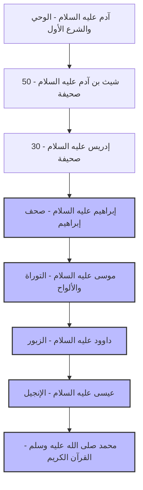

# خط زمني للكتب والصحف السماوية

يوضح هذا الرسم البياني الأنبياء والرسل الذين أنزل الله عليهم كتباً أو صحفاً أو ألواحاً، مع ذكر القوم المرسل إليهم واسم الكتاب، مرتبة زمنياً.

---

### تفاصيل ومصادر الكتب والصحف

#### 1. آدم عليه السلام
*   **المصدر:** القرآن والسنة.
*   **التفاصيل:** لم ينزل عليه "كتاب" بمسمى مشهور، لكن الله علمه الأسماء كلها وأوحى إليه بالشرع الأول ليبدأت به البشرية.

#### 2. شيث بن آدم عليه السلام
*   **المصدر:** حديث أبي ذر (أخرجه ابن حبان)، وذكره ابن كثير في البداية والنهاية.
*   **الكتاب:** **(50 صحيفة)**.
*   **ملاحظة:** تحديد عدد الصحف بـ 50 هو من حديث أبي ذر الذي اختلف العلماء في صحته، ويرد كثيراً في الإسرائيليات التاريخية.

#### 3. إدريس عليه السلام
*   **المصدر:** حديث أبي ذر، وذكره ابن كثير.
*   **الكتاب:** **(30 صحيفة)**.
*   **ملاحظة:** المعلومات عن عدد صحفه مصدرها التاريخ والآثار المروية عن أهل الكتاب (إسرائيليات).

#### 4. إبراهيم عليه السلام
*   **المصدر:** **القرآن الكريم** (سورة الأعلى والنجم: "صحف إبراهيم وموسى").
*   **الكتاب:** **(الصحف)**.
*   **ملاحظة:** ورد في حديث أبي ذر أنها كانت 10 صحف، لكن الثابت يقيناً في القرآن وجود "صحف" له.

#### 5. موسى عليه السلام
*   **المصدر:** **القرآن الكريم** (في مواضع كثيرة).
*   **الكتاب:** **(التوراة والألواح)**.
*   **القوم:** بني إسرائيل وقبائل القبط (فرعون وقومه).
*   **تنبيه:** أُنزلت عليه الألواح أولاً في الميقات، وهي جملة التوراة.

#### 6. داوود عليه السلام
*   **المصدر:** **القرآن الكريم** ("وآتينا داوود زبوراً").
*   **الكتاب:** **(الزبور)**.
*   **القوم:** بني إسرائيل.

#### 7. عيسى عليه السلام
*   **المصدر:** **القرآن الكريم** ("وآتيناه الإنجيل فيه هدى ونور").
*   **الكتاب:** **(الإنجيل)**.
*   **القوم:** بني إسرائيل.

#### 8. محمد ﷺ
*   **المصدر:** **القرآن الكريم**.
*   **الكتاب:** **(القرآن الكريم)** المهيمن على كل ما قبله من الكتب.
*   **القوم:** كافة الناس والجن (خاتم الأنبياء والكتب).

---

### الفرق بين "خصوصية" رسالات الأنبياء و"عالمية" رسالة محمد ﷺ

يتضح من التتبع التاريخي والقرآني أن جميع الأنبياء السابقين أُرسلوا إلى أقوامهم خاصة، بينما كانت رسالة النبي محمد ﷺ عامة وشاملة لكل الخلق، وذلك وفق الأدلة والعوامل التالية:

#### 1. الأدلة من القرآن الكريم
*   **العموم المطلق:** قوله تعالى: ﴿وَمَا أَرْسَلْنَاكَ إِلَّا كَافَّةً لِلنَّاسِ بَشِيرًا وَنَذِيرًا﴾ [سبأ: 28]. يذكر **ابن كثير** في تفسيره أن "كافة للناس" تعني لجميع الخلق من المكلفين، وهي من خصائصه ﷺ.
*   **الخطاب للجميع:** قوله تعالى: ﴿قُلْ يَا أَيُّهَا النَّاسُ إِنِّي رَسُولُ اللَّهِ إِلَيْكُمْ جَمِيعًا﴾ [الأعراف: 158].
*   **الرحمة للعالمين:** قوله تعالى: ﴿وَمَا أَرْسَلْنَاكَ إِلَّا رَحْمَةً لِلْعَالَمِينَ﴾ [الأنبياء: 107]. يوضح **القرطبي** أن "العالمين" تشمل الإنس والجن، بل وحتى الحيوان والجمادات قد نالت بركة رحمته.

#### 2. الأدلة من السنة النبوية الشريفة
*   **التميز بالعموم:** في الحديث الصحيح (البخاري ومسلم): "أعطيتُ خمساً لم يُعطهن أحدٌ من الأنبياء قبلي... **وكان النبيُّ يُبعثُ إلى قومه خاصة، وبُعثتُ إلى الناس عامة**".
*   **الشمول اللوني والجغرافي:** قوله ﷺ: "وبُعثتُ إلى كلِّ أحمرَ وأسود"، وهو ما استدل به العلماء على شمول رسالته لكل الأعراق والأجناس دون استثناء.

#### 3. التعليل العلمي عند كبار المفسرين
*   **ختم النبوة:** ذكر العلماء (كابن كثير والقرطبي) أن الأنبياء السابقين كانت رسالاتهم بمثابة "مصابيح" تضيء لأقوامهم في أزمنة وأماكن محدودة، تمهيداً للرسالة الكبرى. وبما أن النبي محمد ﷺ هو **خاتم الأنبياء**، وجب أن تكون رسالته دائمة وعامة، لتستمر حتى قيام الساعة.
*   **كمال التشريع:** شريعة الأنبياء السابقين كانت تعالج قضايا خاصة ومؤقتة بأقوامهم، أما شريعة الإسلام فهي الشريعة "المهيمنة" وجامعة لكل مكارم الأخلاق وأصول التشريع التي تصلح لكل زمان ومكان.
*   **بقاء الحجة:** لو كانت رسالته لغير الناس كافة، لما استقامت الحجة على الخلق بعد انقطاع الوحي بوفاته ﷺ.

---

### الحكمة من اختيار الزمان والمكان للرسالة الخاتمة

لقد تساءل العلماء والمفسرون (مثل **ابن كثير** في "البداية والنهاية" و**البوطي** في "فقه السيرة") عن سر اختيار القرن السابع الميلادي وشبه الجزيرة العربية مهداً للدعوة الخاتمة، وخلصوا إلى عدة حِكَم جليلة:

#### 1. لماذا هذا الزمان (القرن السابع الميلادي)؟
*   **نضج العقل البشري:** يرى العلماء أن البشرية مرت بمراحل "طفولة" كانت تحتاج فيها إلى معجزات حسية مادية (كعصا موسى وإحياء عيسى للموتى). أما في زمن النبي ﷺ، فقد بلغ العقل البشري درجة من النضج تؤهله لاستقبال "معجزة بيانية وعقلية" (القرآن الكريم) تخاطب الفكر وتبقى محفوظة للأبد.
*   **فساد المنظومات العالمية:** كانت الإمبراطوريات الكبرى (الروم والفرس) قد وصلت إلى حالة من الانحلال القيمي والديني والسياسي، مما جعل العالم في أمسّ الحاجة إلى "منقذ" ومنهج حياة جديد يعيد التوازن للبشرية.
*   **انقطاع الوحي وفترة "الفترة":** بعثه الله بعد انقطاع من الرسل وطمس للمعالم، ليكون المتمم والمهيمن على ما بقي من آثار الرسالات السابقة.

#### 2. لماذا هذا المكان (شبه الجزيرة العربية)؟
*   **صفاء الفطرة والبيئة:** لم تتكن مكة والجزيرة العربية تحت سطوة فلسفات معقدة أو وثنيات محرفة كاليونان أو الفرس. كانت عقول العرب "بِكراً" وصافية، فإذا استناروا بالحق صاروا أقوى المدافعين عنه، بخلاف الأمم الغارقة في الجدل الفلسفي.
*   **الموقع الجغرافي المركزي:** تتوسط الجزيرة العربية قارات العالم القديم (آسيا، أفريقيا، أوروبا)، مما جعلها نقطة انطلاق مثالية لتصل الرسالة شرقاً وغرباً بسرعة فائقة.
*   **عبقرية اللغة العربية:** اختار الله العربية لتكون وعاء الخاتمة لأنها أقوى اللغات في البيان، والاشتقاق، والدقة في التعبير، مما سمح للقرآن أن يكون معجزة لغوية تتحدى الفصحاء إلى يوم القيامة.
*   **استمرارية الموروث الإبراهيمي:** كانت الكعبة (بيت الله الحرام) وبقايا الحنيفية في مكة توفر أرضية روحية للانطلاق وربط الرسالة الخاتمة بأب الأنبياء إبراهيم عليه السلام.

#### 3. لماذا هذا النبي (القرشي الأمي)؟
*   **قطع الشك في مصدر الوحي:** كونه ﷺ "أمياً" لا يقرأ ولا يكتب في أمة أمية، كان دليلاً قوياً على أن هذا القرآن وحي سماوي وليس من نتاج قراءاته أو دراساته الفلسفية.
*   **السيادة الأخلاقية:** كان معروفاً بـ "الصادق الأمين" قبل البعثة، مما أقام الحجة على قومه أن من لا يكذب على الناس، لا يكذب على الله.

---

### المصادر والمراجع المعتمدة

لإعداد هذا الملف وتوثيق المعلومات الواردة فيه، تم الاعتماد على أمهات الكتب والمصادر الإسلامية التالية:

1.  **تفسير القرآن العظيم (تفسير ابن كثير):** للحافظ ابن كثير (ت 774هـ) - المصدر الأساسي في تفسير الآيات وربطها بالسياق التاريخي.
2.  **البداية والنهاية:** لابن كثير - لتوثيق قصص الأنبياء وتسلسل الرسالات والكتب السماوية.
3.  **فقه السيرة النبوية:** للدكتور محمد سعيد رمضان البوطي - في تحليل الحِكَم التشريعية والزمانية والمكانية للبعثة الخاتمة.
4.  **الرحيق المختوم:** للشيخ صفي الرحمن المباركفوري - لتوصيف حال الجزيرة العربية وموقعها قبل الإسلام.
5.  **زاد المعاد في هدي خير العباد:** لابن القيم الجوزية - في بيان خصائص الشريعة الإسلامية وعمومها.
6.  **صحيح البخاري وصحيح مسلم:** لاستخراج الأحاديث النبوية الصحيحة المتعلقة بفضائل النبي ﷺ وخصوصية بعثته.
7.  **الجامع لأحكام القرآن (تفسير القرطبي):** للإمام القرطبي - لبيان دلالات الألفاظ القرآنية المتعلقة بالعالمين والرحمة العامة.

---
> **ملاحظة عامة:** الأنبياء والرسل كثيرون جداً، لكن هؤلاء هم من نُص على إنزال كتب أو صحف بعينها عليهم في المصادر المعتبرة. المعلومات المتعلقة بأعداد الصحف (50، 30، 10) وردت في آثار تاريخية وأحاديث اختلف في درجتها، وهي أقرب لمنقولات أهل الكتاب (إسرائيليات) التي يُستأنس بها في التاريخ.
