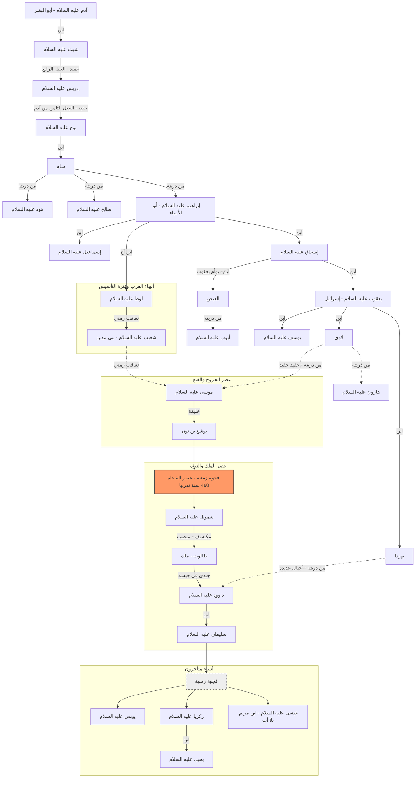

# تسلسل وعلاقات الأنبياء وجغرافيتهم (من آدم إلى عيسى عليه السلام)

هذا الملف ملخص شامل يجمع بين المعلومات الواردة في ملخصاتك وبين أمهات الكتب الموثوقة (ككتاب ابن كثير "قصص الأنبياء").

---

## 1. شجرة الأنبياء والعلاقات

هذا الرسم يوضح الروابط الأسرية بين الأنبياء المذكورين في ملخصاتك:

---

## 2. الجدول الزمني والتعاقب

> [!NOTE]
> التواريخ الدقيقة قبل الميلاد هي تقديرية من المؤرخين، حيث لم يذكر القرآن أو السنة أعواماً محددة، ولكن تم ترتيبهم حسب الأجيال.

| الترتيب | النبي       | الفترة/السياق      | ملاحظات المصادر                              |
| :------ | :---------- | :----------------- | :------------------------------------------- |
| 1       | **آدم**     | بداية الخلق        | أول الأنبياء والبشر.                         |
| 2       | **إدريس**   | بعد آدم بزمن       | أول من خط بالقلم.                            |
| 3       | **نوح**     | بعد 10 قرون من آدم | أول رسول أرسل للبشر بعد وقوع الشرك.          |
| 4       | **هود**     | بعد الطوفان        | أرسل إلى قوم عاد (الأحقاف).                  |
| 5       | **صالح**    | بعد قوم عاد        | أرسل إلى قوم ثمود (الحجر).                   |
| 6       | **إبراهيم** | عصر النمرود        | هاجر من العراق إلى الشام ثم مصر ومكة.        |
| 7       | **لوط**     | عاصر إبراهيم       | أرسل إلى قوم سدوم (البحر الميت).             |
| 8       | **إسماعيل** | ابن إبراهيم        | بنى الكعبة مع أبيه ومسكنه مكة.               |
| 9       | **إسحاق**   | ابن إبراهيم        | ولد في الشام وهو جد أنبياء بني إسرائيل.      |
| 10      | **يعقوب**   | ابن إسحاق          | يلقب بـ "إسرائيل"، وذريته هم بنو إسرائيل.    |
| 11      | **يوسف**    | ابن يعقوب          | انتقل إلى مصر ومكن الله له فيها.             |
| 12      | **شعيب**    | بعد لوط            | أرسل إلى أهل مدين (أصحاب الأيكة).            |
| 13      | **أيوب**    | من ذرية إبراهيم    | ضرب به المثل في الصبر على البلاء.            |
| 14      | **يونس**    | -                  | أرسل إلى نينوى (العراق).                     |
| 15      | **موسى**    | عصر الفراعنة       | كليم الله، أخرج بني إسرائيل من مصر.          |
| 16      | **هارون**   | شقيق موسى          | وزيره ونبي معه.                              |
| 17      | **يوشع**    | فتى موسى           | هو الذي فتح بيت المقدس (القدس).              |
| 18      | **داوود**   | ملك ونبي           | قتل جالوت وآتاه الله الزبور.                 |
| 19      | **سليمان**  | ابن داوود          | سخر الله له الريح والجن والحيوان.            |
| 20      | **زكريا**   | معاصر لعيسى        | كفل مريم ودعا بالولد وهو كبير.               |
| 21      | **يحيى**    | ابن زكريا          | عاصر عيسى وقتل شهيداً.                       |
| 22      | **عيسى**    | المسيح عليه السلام | ولد من مريم بلا أب، خاتم أنبياء بني إسرائيل. |

---

## 3. المواقع الجغرافية والمعالم الحديثة

تأكيداً على طلبك لربط الأسماء بالخريطة الحديثة:

| المسمى القديم في القصص | النبي المرتبط به | الموقع الحديث (المرجح) |
| :--- | :--- | :--- |
| **بابل** | إبراهيم | **العراق** (محافظة بابل حالياً). |
| **الأحقاف** | هود | **اليمن وعمان** (منطقة بين حضرموت وظفار). |
| **الحجر** (مدائن صالح) | صالح | **السعودية** (محافظة العلا - العلا). |
| **مدين** | شعيب / موسى | **السعودية** (منطقة تبوك - مدينة البدع). |
| **سدوم** (المؤتفكات) | لوط | **الأردن وفلسطين** (منطقة البحر الميت). |
| **مصر القديمة** | يوسف / موسى / عيسى | **جمهورية مصر العربية**. |
| **نينوى** | يونس | **العراق** (مدينة الموصل وشمالها). |
| **بيت المقدس** | يوشع / داوود / زكريا / عيسى | **فلسطين** (مدينة القدس وما حولها). |
| **مكة** (بكة) | إسماعيل / إبراهيم | **السعودية** (مكة المكرمة). |

---

## 4. ملاحظات حول دقة المعلومات

- **المصادر**: تم الاعتماد بشكل أساسي على ما ورد في **القرآن الكريم** و**السنة النبوية** لضمان اليقين.
- **الإسرائيليات**: المعلومات التي تتعلق بأسماء أبناء الأنبياء (غير المذكورين في القرآن) أو تفاصيل أعمارهم (مثل ما ورد عن شيث أو العيص) مأخوذة من كتب التاريخ المعتبرة كـ "البداية والنهاية" لابن كثير، وتُذكر للاستئناس والربط التاريخي وليس كعقيدة يقينية مطلقة إذا لم تثبت بنص شرعي صريح.
- **التواريخ**: الأرقام المتعلقة بـ "10 قرون بين آدم ونوح" وردت في حديث نبوي صحيح، أما ما سواها من تقديرات زمنية بالسنين فهي اجتهادات تاريخية تحتمل الصواب والخطأ.

---